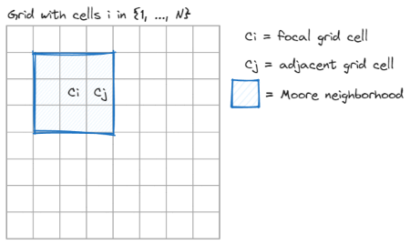

# hndsr-terrain-data

This repository holds code for downloading and extrapolating terrain data from
US federal datasets across the US Southwest as part of the NSF supported
project:

> Collaborative Research: HNDS-R: Human Networks, Sustainable Development, and
> Lived Experience in a Nonindustrial Society
> ([BCS-2213921](https://www.nsf.gov/awardsearch/showAward?AWD_ID=2213921))

## 🌎 Coordinate Reference System

Name: NAD83

EPSG: 4269 (<https://epsg.io/4269>)

## ⛰️ Terrain Statistics

Each statistic is derived from a digital elevation model.

{width="500"}

1.  **Elevation**

    Global average: $\frac{1}{N}\sum_{i=1}^{N}C_{i}$

    **Motivation:** this is strongly correlated with temperature and
    precipitation.

2.  **Terrain Ruggedness Index (TRI) RMSD**

    Statistic for local neighborhood:

    $$TRI_{i} = \left[\frac{1}{8}\sum_{j=1}^{8}(C_{i} - C_{j})^{2}\right]^{1/2}$$

    In English (sort of), the square root of the average squared difference
    between focal cell $i$ and its adjacent cells $j$. This is similar to the
    standard deviation.

    Global average: $\frac{1}{N}\sum_{i=1}^{N}TRI_{i}$

    **Motivation**: this gives a general sense of how rugged a terrain is, so it
    can proxy for the costs of irrigation and the costs of travel.

3.  **Topographic Position Index (TPI)**

    Statistic for local neighborhood:

    $$TPI_{i} = C_{i} - \frac{1}{8}\sum_{j=1}^{8}C_{j}$$

    In English, the difference between focal cell $i$ and the average value of
    its neighbors. A positive value means $i$ is generally higher in elevation
    than its neighbors. A negative value means $i$ is generally lower in
    elevation than its neighbors.

    Global average: $\frac{1}{N}\sum_{i=1}^{N}TPI_{i}$

    **Motivation**: this is similar to TRI, but it also provides information
    about the frequency of potential "sinks" in the terrain, or places where
    water can pool, so it can proxy for run-off potential.

4.  **Proportion Flat Ground**

    Degree slope of focal cell:

    $$S_{i} = (180/\pi) \cdot atan\left[\frac{1}{8}\sum_{j=1}^{8}(C_{i}-C_{j})/d_{ij}\right]$$

    with $d_{ij}$ being the distance between center points of cells $i$ and $j$.
    In English, we convert average rise-over-run into average degrees.

    Global average: $\frac{1}{N}\sum_{i=1}^{N} I(S_{i} \leq K)$

    Here, $I$ is an indicator function, which is equal to 1 if slope is less
    than or equal to K and 0 otherwise. Currently, we are estimating this using
    $K=5^{\circ}$ as the threshold.

    **Motivation**: this gives the proportion of the terrain on which
    individuals could farm without investing in substantial terracing or other
    forms of landscape management.
